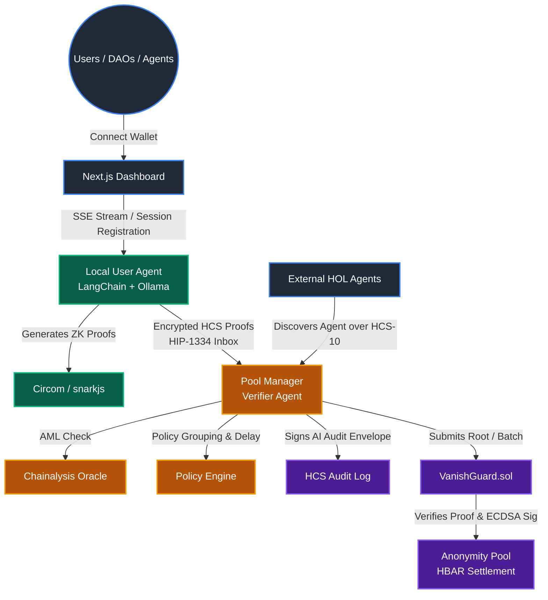

# Vanish: Double-Blind AI Privacy Layer for Hedera

**Vanish** is a production-grade, AI-driven privacy protocol built natively on the Hedera network. It operates as a "Double-Blind" system where **Local AI Agents** (Provers) interface with a **Global Guardian Agent** (Verifier) to provide anonymous fund transfers, stealth addresses, and zero-knowledge shielded pools—all while enforcing autonomous Anti-Money Laundering (AML) compliance heuristics.

This project merges **Next.js UI paradigms**, **Zero-Knowledge Cryptography (Groth16/Circom)**, **LangChain/Ollama autonomous agents**, and **Hedera's Consensus Service (HCS) / Smart Contract Service (HSCS)** into a unified, agentic architecture.

---

## 🏗️ Architecture Flow



---

## 📡 Sequence Diagram: Shield & Withdraw

```mermaid
sequenceDiagram
    participant User as Next.js Dashboard
    participant UA as Local User Agent
    participant PM as Pool Manager (Verifier)
    participant SC as VanishGuard (Smart Contract)
    
    %% Shielding Phase
    rect rgb(30, 41, 59)
    note right of User: Phase 1: Shielding Deposit
    User->>UA: "Shield 50 HBAR" (Natural Language / Button)
    UA->>UA: Generate secret & nullifier
    UA->>UA: Compute Commitment = Poseidon(nullifier, secret, 50)
    UA->>UA: Generate Groth16 ZK-SNARK Proof locally (snarkjs)
    UA->>PM: Send Encrypted HIP-1334 Proof (to PM's HCS Inbox)
    PM->>PM: Verify Groth16 Proof (Math Check)
    PM->>PM: Chainalysis AML Heuristic Check
    PM->>PM: Wait for diverse liquidity (Privacy Entropy)
    PM->>SC: submitBatchWithDecision(Batch, Proofs, AI ECDSA Sig)
    SC->>SC: Verify Proofs & AI Signature on-chain
    SC->>SC: Update Merkle Tree Root
    SC-->>PM: Tx Success (Event Emitted)
    end
    
    %% Withdrawal Phase
    rect rgb(15, 23, 42)
    note right of User: Phase 2: Anonymous Withdrawal
    User->>UA: "Withdraw 50 HBAR to 0.0.xyz"
    UA->>UA: Fetch current Merkle Root (Ghost Sync)
    UA->>UA: Generate Groth16 Withdrawal Proof
    UA->>PM: Encrypted HIP-1334 Proof Transmit
    PM->>PM: Verify Integrity & Policy Guard
    PM->>SC: contract.withdraw(Nullifier Base, Recipient, Proof)
    SC->>SC: Verify Proof matches Merkle Root
    SC-->>User: 50 HBAR lands in 0.0.xyz anonymously
    end
```



---

## 🌍 Live Testnet Deployments (Vanish 2026.1)

If you are connecting natively to the Hedera Testnet, the following endpoints are currently active for the Vanish network.

| Component | Identifier / Account ID |
| :--- | :--- |
| **VanishGuard Smart Contract** | `0.0.8277357` |
| **Pool Manager Account** | `0.0.8274009` |
| **HIP-1334 Proof Inbox** | `0.0.8210357` |
| **Private Data Topic** | `0.0.8119062` |
| **Public Announcement Topic** | `0.0.8119063` |

### 🤖 Hashgraph Online (HOL) Registry Endpoints
Other agents and DAOs can dynamically look up Vanish Concierge services via HCS-10 on the testnet:

**Vanish Pool Manager (AI Verifier):**
- HOL Agent Account: `0.0.8309522`
- Inbound Topic: `0.0.8309524`
- Outbound Topic: `0.0.8309523`
- Profile Topic: `0.0.8309528`

**Vanish Agentic Pool (Proxy):**
- HOL Agent Account: `0.0.8330708`
- Inbound Topic: `0.0.8330713`
- Outbound Topic: `0.0.8330711`
- Profile Topic: `0.0.8330728`

---

## 🔐 Cryptography Deep Dive

### 1. ZK-Shielding (Nullifiers & Commitments)
- A deposit creates a `commitment = Poseidon(nullifier, secret, amount)`.
- Re-spending requires calculating the `nullifierHash = Poseidon(nullifier)` and generating a SNARK proving knowledge of the private inputs that match a public commitment in the on-chain Merkle root.
- The `shield.circom` and `withdraw.circom` circuits use **Poseidon Hashing** for leaf generation (reducing gas costs massively) while utilizing **SHA-256** for internal Merkle proof nodes to maintain compatibility with Hedera's EVM precompiles.

### 2. Stealth Addresses (secp256k1 Homomorphic Derivation)
To execute anonymous, direct internal pool transfers without leaking linkability:
1. User Agent generates an ephemeral X25519 keypair.
2. Computes a shared secret via ECDH against the recipient's public View Key.
3. The shared secret is hashed into a scalar offset.
4. Using homomorphic derivation: `stealthPrivate = (spendPrivate + offset) mod n`.
5. The funds are sent to the resulting public key, and an encrypted HCS message alerts the recipient to derive the offset and claim.

---

## ⚙️ Getting Started & Testing

### Prerequisites
- Node.js 18+
- Hardhat (`npm i -g hardhat`)
- Circom 2.x (For circuit compiling)
- Ollama (Optional: For Llama 3.1 AI decision capabilities)

### General Setup
1. Clone the repository and install root dependencies:
   ```bash
   npm install --legacy-peer-deps
   ```
2. Setup the `.env` file based on `.env.example`.

### Compiling Smart Contracts & Circuits
```bash
npm run compile
npm run compile:circuits
npm run deploy:contract
```

### 🧪 Running Tests
Vanish includes comprehensive testing suites for the agents and ZK components.

```bash
# 1. Test Prover/Verifier protocol loop (Shield & Withdraw paths)
npm run test:agents

# 2. Test the mathematical logic underlying ZK fragmentation
npm run test:fragmentation

# 3. Test Agentic AI intent mapping vs Rules Enging
npm run test:ai

# 4. Under-load testing for ZK-proof generation overhead on Node.js
npm run test:performance
```

### Starting the Agentic Infrastructure
You can run the full local network via concurrently:
```bash
npm run start:all
```
*Alternatively, start components individually:*
- Pool Manager: `npm run start:pool`
- User Agent: `npm run start:user`
- AI-Mode User Agent: `npm run start:user:ai`

### Starting the Frontend UI
Open a new terminal session, navigate to the `frontend` folder:
```bash
cd frontend
npm install --legacy-peer-deps
npm run dev
```
Navigate to `http://localhost:3000` to access the Vanish UI Dashboard.

---

## 📜 License
MIT License. Created by the Vanish Team (2026).
